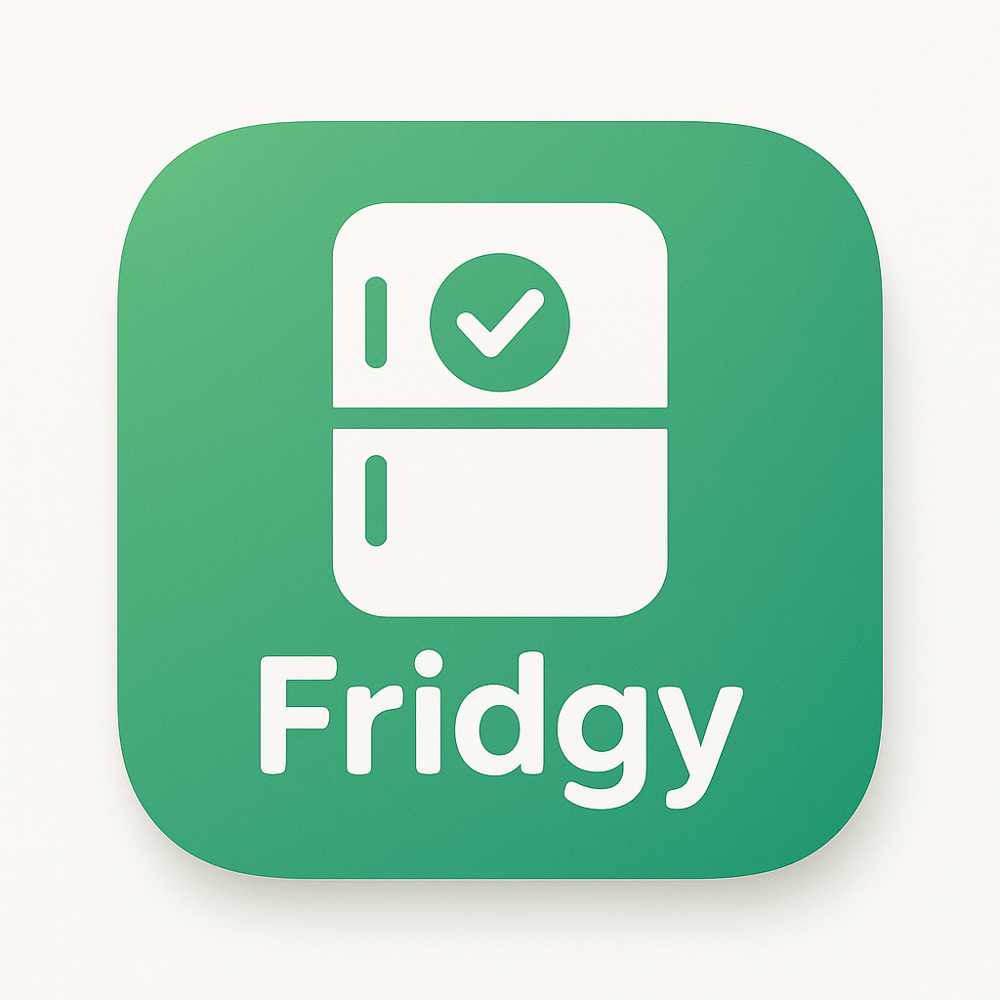
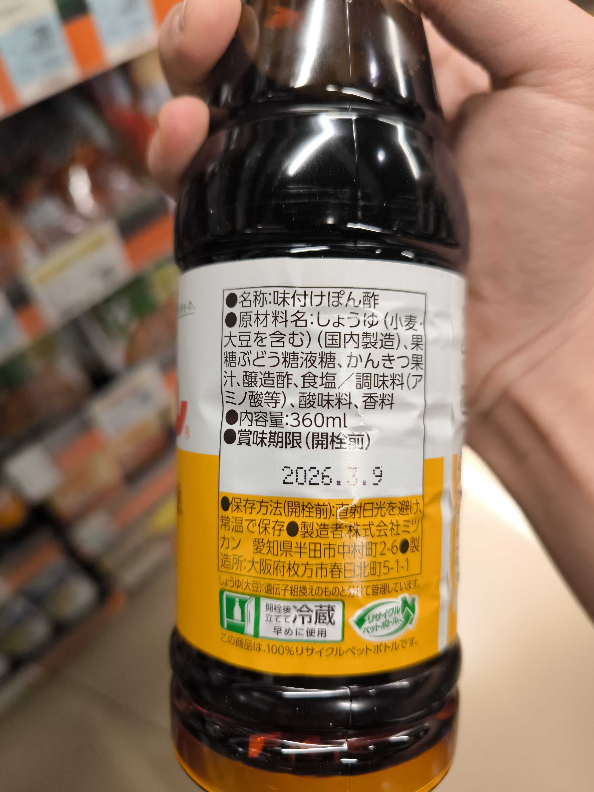
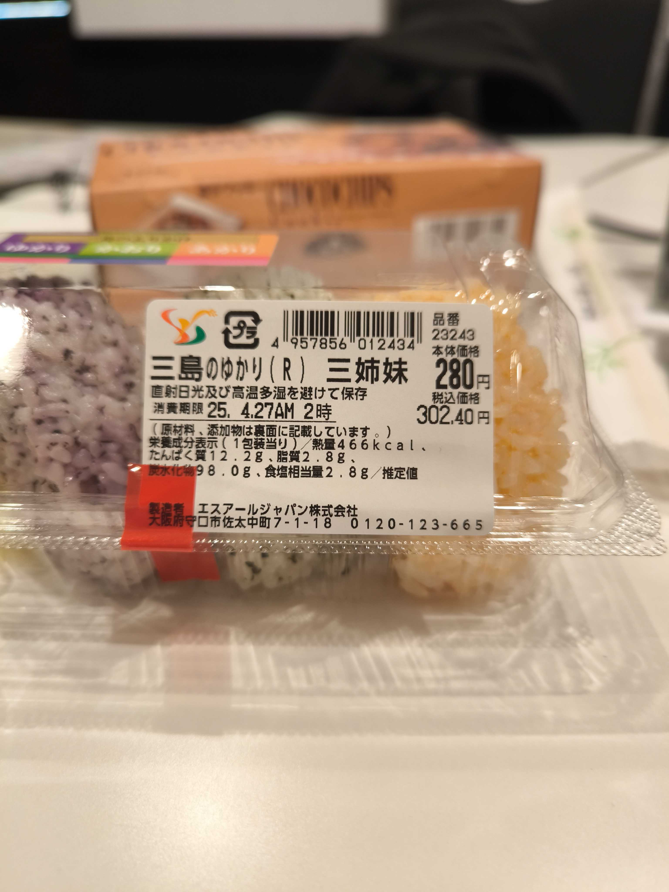
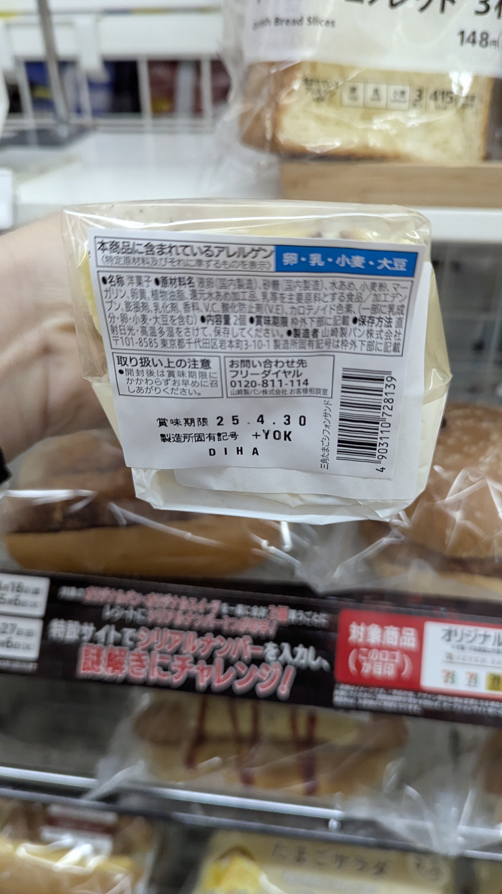
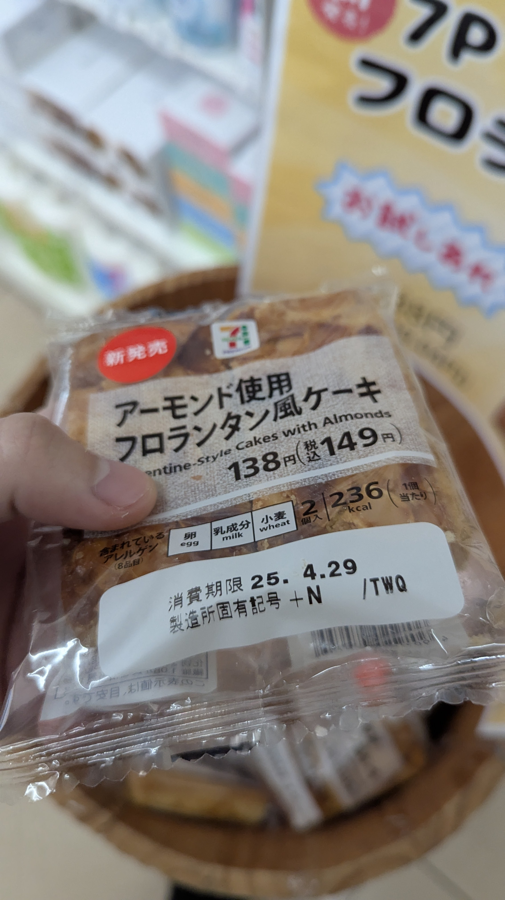
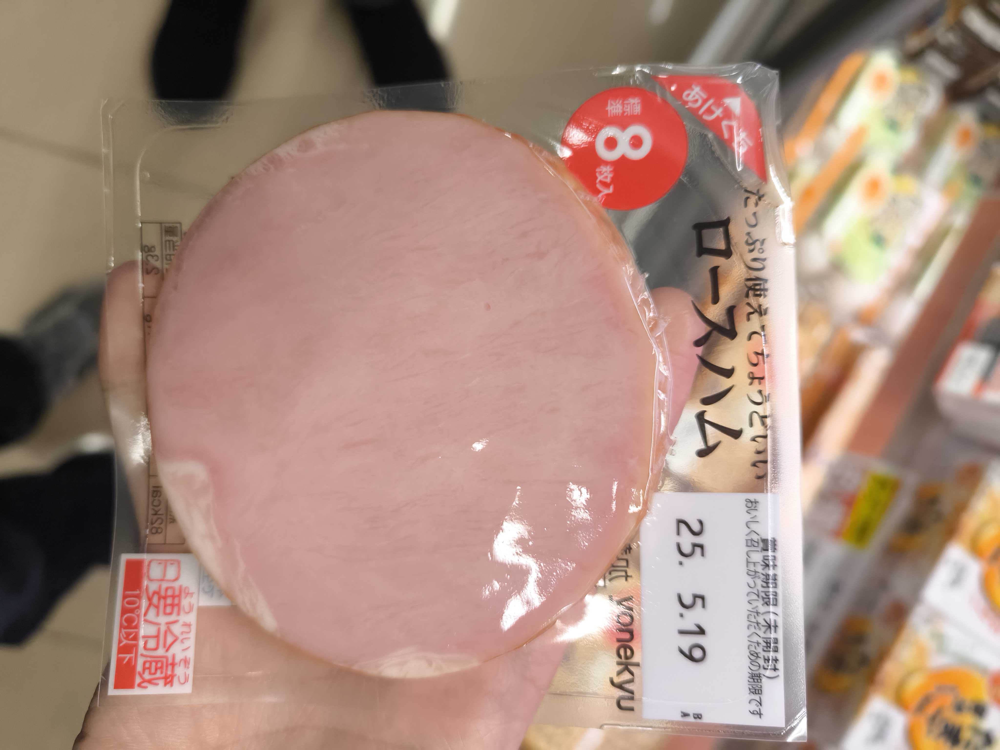
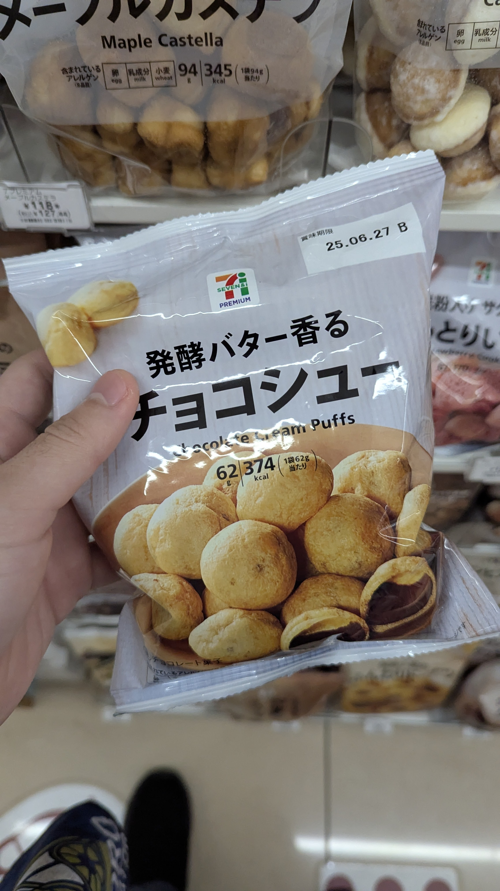
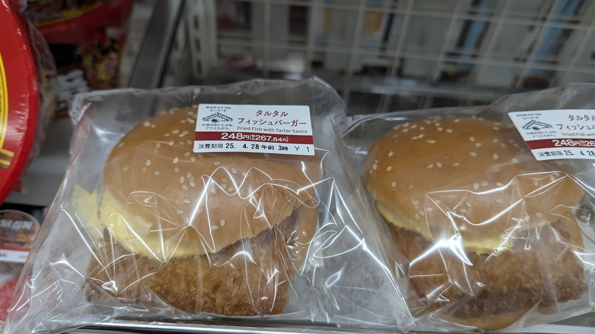

# 食品期限管理アプリ

## AI × 食品管理で食品ロスを削減

---

# プロジェクト概要

- **課題**: 家庭での食品ロスが年間約 276 万トン（2021 年度）
- **解決策**: AI を活用した食品期限管理アプリ
- **特徴**: 写真を撮るだけで賞味期限を AI が自動認識

---

# 技術スタック

- **フロントエンド**: Next.js + Shadcn UI + Tailwind CSS
- **バックエンド**: FastAPI
- **AI/ML**: 画像認識 + テキスト解析
- **ストレージ**: Cloudflare R2

---

# 主な機能

- 写真から食品情報を自動認識
- 期限が近い順に食品を表示
- カテゴリ別フィルタリング
- 食品データの可視化
- データのインポート/エクスポート

---

# デモ画面：食品一覧

- 賞味期限が近い順に表示
- 残り日数のグラデーション表示
- 写真付きでわかりやすい管理

---

# デモ画面：写真分析

- カメラで撮影するだけで簡単登録
- AI が自動で以下を認識:
  - 商品名
  - 期限日
  - 分量
  - カテゴリ

---

# 技術的なハイライト

1. **写真認識処理フロー**:

   - 画像アップロード → AI 解析 → データ抽出 → 結果表示

2. **UI/UX 設計**:

   - 直感的なインターフェース
   - モバイルフレンドリー設計

3. **データ管理**:
   - ローカルストレージと連携
   - JSON フォーマットのエクスポート/インポート

---

# 開発過程での課題と解決策

## 課題

- 多様な食品パッケージからの賞味期限認識精度
- ユーザーフレンドリーな UI 設計

## 解決策

- AI モデルの学習データ最適化
- ユーザーテストに基づく UI 改善

---

# 今後の展望

- 食品レシピ推薦機能
- 食品ロス統計の可視化
- 買い物リスト連携機能
- コミュニティ機能（食品シェアなど）

---

# チームメンバー

- [メンバー1]: フロントエンド開発
- [メンバー2]: バックエンド開発
- [メンバー3]: AIモデル開発
- [メンバー4]: デザイン・UI/UX

---

# ご清聴ありがとうございました

## 質問・フィードバックをお待ちしています

